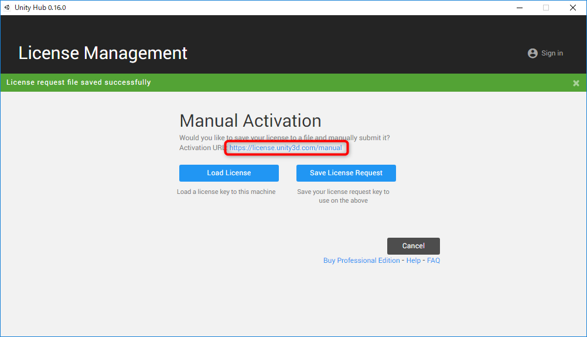

# Unity HubとUnity2018.1.0f2のインストール
## Unity Hubをインストール
Unityのバージョンやパッケージ管理用のUnity謹製のツールです。これをインストールしておくと、複数のバージョンを簡単に共有ができる上に、バージョンアップも簡単になるので入れておきます。

- https://public-cdn.cloud.unity3d.com/hub/prod/UnityHubSetup.exe からインストーラーをダウンロード
- ダウンロードした`UnityHubSetup.exe`を起動
- ライセンスを同意する

- アクセスを許可してパスワード入力

以上でインストール完了して、Unity Hubが起動する。

## Unity2018.1.0f2のインストール
Unity Hubからインストールできます。

- Installsをクリック
- Official Releasesをクリック
- Unity 2018.1.0f2 の右のDownloadをクリック

- インストールする項目を以下のように設定
  - Standard AssetsとWebGL Build Supportにチェックを入れる

- 他に必要なものがあったらチェックを入れて、Doneをクリック

ダウンロードとインストールが自動的に始まるので、完了まで待つ。

以上で完了です。

# ライセンスの通し方
Unityは、ファイルベースでのライセンス確認ができます。これを設定しておくと、違うアカウントでもライセンスを通しなおす必要がなくなる可能性があります。

## 手順
- Unityを起動
- HelpメニューからManageLicese...を選択

- Manual Activationをクリック

- Save License Requestをクリック

すべてのユーザーからアクセスできるパブリックのドキュメントフォルダーに保存します。

- Windows7_OS (C:)を選択してから、ユーザーをダブルクリックで開く

- パブリックをダブルクリック

- パブリックのドキュメントをダブルクリック

- 保存ボタンをクリックして、ライセンスファイルを保存

保存したファイルを指定して、アクティベーションします。

- Activation URLの後ろのリンクをクリックしてアクティベーションページを開く

- 学校のUnityライセンスでサインイン

- Browseをクリックして、先ほどパブリックのドキュメントフォルダー内に保存した`Unity_lic.alf`を開く

- Nextボタンをクリック
- Activate your licenseで、Unity Personal Editionを選択して、Nextをクリック

- Download license fileをクリックして、パブリックのドキュメントフォルダー内に、保存する
  - <b>保存時に、`.xml`という拡張子が付く場合、拡張子を消すこと</b>

保存が完了したら、保存したライセンスファイルをUnityで読み込む。

- Unityに切り替える
- Load Licenseボタンをクリック

- パブリックのドキュメントフォルダーにダウンロードしたライセンスファイルを選択して、OKをクリック

以上で、Start Using Unityをクリックして開始する。

# 注意！
